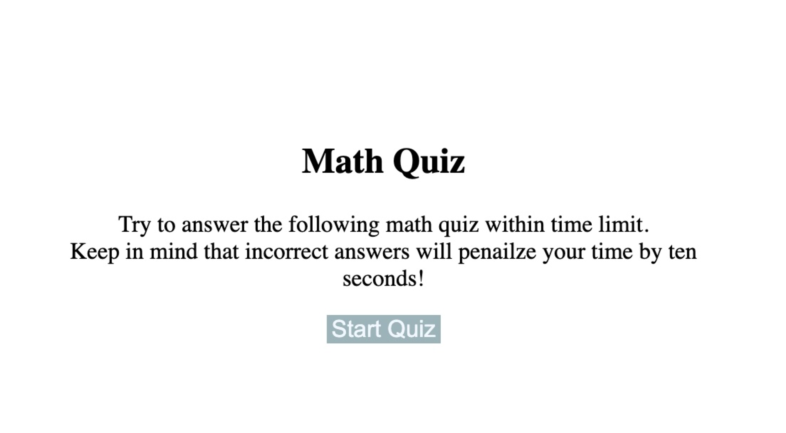

# math-quiz-challenge

## About This Project
This project is to generate a math quiz including three simple tests.
Some problems needs to be emphasized:
  - How to store score data;
  - solve the problem of switch pages.
  - set timer.
      
## Installation

## Usage

Step:
  - 1. CLick 'Start Quiz' button to answer questions.
  - 2. when finished, enter initials to store score.

;

Link:
https://kayexie.github.io/math-quiz-challenge/
https://github.com/Kayexie/math-quiz-challenge

## Credits
N/A

## License
N/A